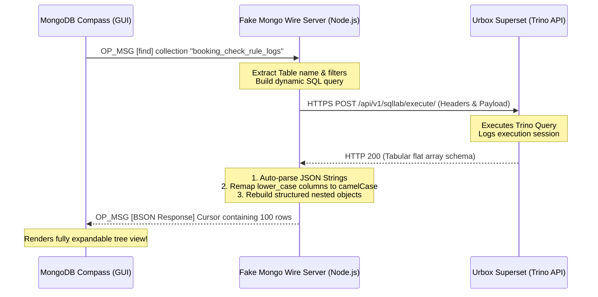

# Fake MongoDB Wire Protocol Server (SQLab to MongoDB Compass)

A lightweight, zero-dependency, high-performance mock MongoDB server built natively in Node.js using raw TCP sockets (`net` module). It intercepts queries from the official **MongoDB Compass** desktop application, dynamically queries the upstream enterprise **Urbox SQL / Superset (Trino)** service, and formats relational outputs back into fully structured MongoDB JSON arrays and objects.

---

## 🌟 Features

- **Raw TCP Wire Protocol (OP_MSG & OP_QUERY):** Fully emulates the MongoDB Wire Protocol (version 3.6+) on port `27017`.
- **Administrative Handshakes & Commands:** Implements full mock hooks for administrative setup commands (`isMaster`, `ping`, `connectionStatus`, `getParameter`, `hostInfo`, `serverStatus`, `buildInfo`, `aggregate`, `listCollections`, `dbStats`) to let MongoDB Compass connect effortlessly.
- **Dynamic Collection Mapping:** Intercepts native MongoDB `.find({})` calls and maps the collection name dynamically to the SQL table name (e.g., `db.booking_check_rule_logs.find({})` queries `booking_check_rule_logs`).
- **Recursive JSON String Inflation:** Automatically scans all stringified JSON columns returned from SQL and inflates them into native, rich expandable JSON trees.
- **Trino Array-to-Object Schema Recovery:** Decodes Trino’s unnamed nested array structures and converts them back to standard nested BSON objects (e.g., restoring the named `quotaPayload` object: `client`, `resource`, `quantity`, `limits.month`, `identifier`, `requestId`).
- **Case Normalization:** Maps lowercase SQL relational columns back to camelCased MongoDB fields (`campaignid` ➔ `campaignId`, `createdat` ➔ `createdAt`, `bookingcode` ➔ `bookingCode`).
- **Advanced CSRF and Session Cookie Handling:** Automatically appends Origin/Referer headers and formats local session cookies to conform to Superset Flask-SeaSurf criteria.
- **Dynamic Client ID Generation:** Dynamically creates unique 10-character transaction IDs (`client_id`) on each run to avoid Superset unique constraint log database collisions.
- **Zero-Dependency Request Client:** Utilizes Node.js’s native `https` module for 100% compatibility with all active Node.js versions (including Node 14/16/18/20/22+).
- **High-Fidelity Mock Fallback:** Instantly falls back to highly realistic mock schemas if the upstream service is offline or credentials are missing.

---

## 🛠️ Installation & Setup

### 1. Install Dependencies
Initialize dependencies using your preferred package manager (Node 22 is recommended):
```bash
yarn install
# or
npm install
```

### 2. Configure Environment Variables (`.env`)
Create a `.env` file in the root directory (based on your active credentials):
```ini
PORT=27017

# Urbox Superset Session Cookies & CSRF (Copy from Chrome DevTools)
UPSTREAM_CSRF_TOKEN=your_csrf_token_here
UPSTREAM_SESSION_COOKIE=your_session_cookie_here

# Upstream SQL engine parameters (from Superset Query URL/Payload)
UPSTREAM_CLIENT_ID=dFwtVCgIyg
UPSTREAM_DATABASE_ID=54
UPSTREAM_SQL_EDITOR_ID=188
UPSTREAM_SCHEMA=uc_logs
```

---

## 🚀 Running the Server

Start the MongoDB proxy server in development mode:
```bash
yarn start
# or
npm run start
```

Upon starting, you will see the following confirmation console output:
```text
================================================================
🚀 Fake MongoDB Wire Protocol Server is listening on port 27017
👉 Connect your MongoDB Compass to: mongodb://127.0.0.1:27017/sqlab
================================================================
```

---

## 🔌 Connecting MongoDB Compass

1. Launch your **MongoDB Compass** desktop application.
2. Enter the following URI in the connection string input:
   ```text
   mongodb://127.0.0.1:27017/sqlab
   ```
3. Click **Connect**. Compass will successfully load the admin schemas and display `sqlab` as the active database.
4. Click on any collection or table you want to query, or query dynamically in the shell:
   ```javascript
   db.booking_check_rule_logs.find({})
   ```

---

## 🧠 Data Processing Architecture

The following diagram illustrates how the server intercepts and converts queries:



### Complex Type Recovery Example (Array to Object)
**Before (Trino Relational Result):**
```json
[
  [
    [
      [
        "booking-tool",
        "EV721308-shb[card]",
        1,
        [2],
        "EV721308-533398-2231",
        "PSUB854805"
      ]
    ]
  ]
]
```

**After (Server Recovered MongoDB Document):**
```json
{
  "quota": [
    {
      "quotaPayload": {
        "client": "EV721308-shb[card]",
        "resource": "booking-tool",
        "quantity": 1,
        "limits": {
          "month": 2
        },
        "identifier": "EV721308-533398-2231",
        "requestId": "PSUB854805"
      }
    }
  ]
}
```

---

## 📁 Project Structure

```text
├── src/
│   ├── server.ts      # Raw TCP Socket Server & MongoDB Wire parser/handlers
│   ├── upstream.ts    # Upstream HTTPS request client & BSON schema normalizers
│   └── test_api.ts    # (Optional) Dev validation script for direct API testing
├── .env               # Local credential file (ignored in git)
├── .gitignore         # Production build exclusion list
├── package.json       # Script and dependency packages
└── tsconfig.json      # TypeScript compiler specifications
```

---

## 🤝 Pair Programming Credits
Designed and refined alongside **Antigravity** (Google DeepMind team) for senior-level network engineering and clean-code standard compliance.
