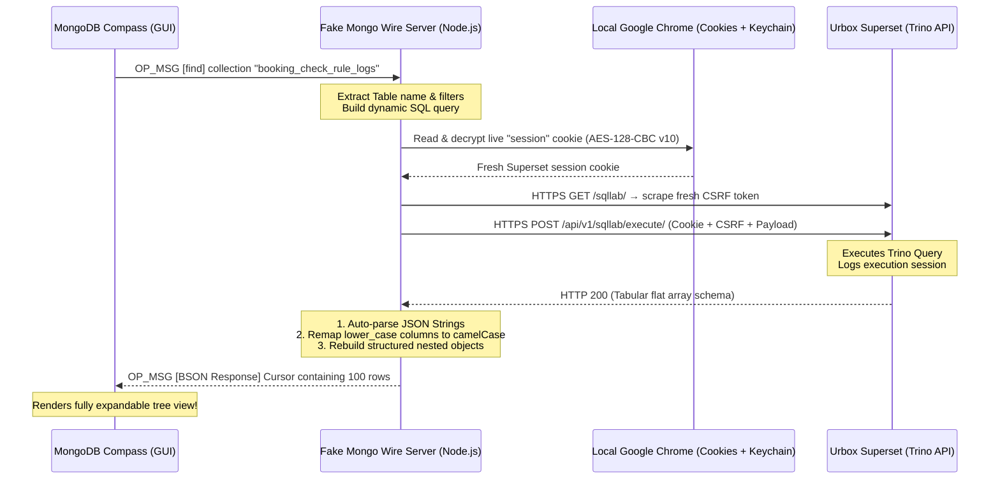

# Fake MongoDB Wire Protocol Server (SQLab to MongoDB Compass)

A lightweight, zero-dependency, high-performance mock MongoDB server built natively in Node.js using raw TCP sockets (`net` module). It intercepts queries from the official **MongoDB Compass** desktop application, dynamically queries the upstream enterprise **Urbox SQL / Superset (Trino)** service, and formats relational outputs back into fully structured MongoDB JSON arrays and objects.

---

## 🌟 Features

- **Raw TCP Wire Protocol (OP_MSG & OP_QUERY):** Fully emulates the MongoDB Wire Protocol (version 3.6+) on port `27017`.
- **Administrative Handshakes & Commands:** Implements full mock hooks for administrative setup commands (`isMaster`, `ping`, `connectionStatus`, `getParameter`, `hostInfo`, `serverStatus`, `buildInfo`, `aggregate`, `listCollections`, `dbStats`) to let MongoDB Compass connect effortlessly.
- **Dynamic Collection Mapping:** Intercepts native MongoDB `.find({})` calls and maps the collection name dynamically to the SQL table name (e.g., `db.booking_check_rule_logs.find({})` queries `booking_check_rule_logs`).
- **Recursive JSON String Inflation:** Automatically scans all stringified JSON columns returned from SQL and inflates them into native, rich expandable JSON trees.
- **Trino Array-to-Object Schema Recovery:** Decodes Trino’s unnamed nested array structures and converts them back to standard nested BSON objects (e.g., restoring the named `quotaPayload` object: `client`, `resource`, `quantity`, `limits.month`, `identifier`, `requestId`).
- **Case Normalization:** Maps lowercase SQL relational columns back to camelCased MongoDB fields (`campaignid` ➔ `campaignId`, `createdat` ➔ `createdAt`, `bookingcode` ➔ `bookingCode`).
- **🍪 Automatic Chrome Session Cookie Extraction (macOS):** Because Superset authenticates via **Google OAuth**, the session cookie expires periodically. Instead of manually copying it into `.env` every time, the server reads and decrypts the live `session` cookie directly from your local Google Chrome (AES-128-CBC `v10`, key sourced from the macOS Keychain). As long as you stay logged in to Superset in Chrome, credentials refresh automatically — no manual editing required.
- **Advanced CSRF and Session Cookie Handling:** Automatically fetches a fresh CSRF token matched to the active session, appends Origin/Referer headers, and formats local session cookies to conform to Superset Flask-SeaSurf criteria. On any CSRF/session expiry error, it re-reads the freshest cookie from Chrome and retries transparently.
- **Dynamic Client ID Generation:** Dynamically creates unique 10-character transaction IDs (`client_id`) on each run to avoid Superset unique constraint log database collisions.
- **Zero-Dependency Request Client:** Utilizes Node.js’s native `https` module for 100% compatibility with all active Node.js versions (including Node 14/16/18/20/22+).
- **High-Fidelity Mock Fallback:** Instantly falls back to highly realistic mock schemas if the upstream service is offline or credentials are missing.

---

## 🛠️ Installation & Setup

### 1. Install Dependencies
Initialize dependencies using your preferred package manager (Node 22 is recommended):
```bash
yarn install
# or
npm install
```

### 2. Authentication — Automatic (Recommended, macOS)

Superset (`query.urbox.services`) logs in via **Google OAuth**, so there is no username/password to script. Instead, the server reads the live `session` cookie straight from your local Google Chrome and decrypts it using the macOS Keychain.

**You only need to do one thing: stay logged in to Superset in Google Chrome.**

- On first run, macOS may show a Keychain prompt for **"Chrome Safe Storage"** — click **Always Allow**.
- The server auto-fetches a fresh CSRF token matched to that session, so you never copy tokens by hand.
- When the cookie expires, just make sure you are still logged in to Superset in Chrome; the server re-reads the newest cookie automatically and retries.

> Requires the `sqlite3` and `security` CLI tools (both ship with macOS by default).

### 3. Configure Environment Variables (`.env`)

Create a `.env` file in the root directory. With automatic Chrome extraction enabled, **`UPSTREAM_CSRF_TOKEN` and `UPSTREAM_SESSION_COOKIE` are optional** — they are only used as a fallback when the Chrome cookie cannot be read (e.g. on non-macOS hosts).

```ini
PORT=27017

# Upstream SQL engine parameters (from Superset Query URL/Payload)
UPSTREAM_CLIENT_ID=********
UPSTREAM_DATABASE_ID=54
UPSTREAM_SQL_EDITOR_ID=188
UPSTREAM_SCHEMA=uc_logs
UPSTREAM_CATALOG=mongo-urcard

# --- Optional cookie controls ---
# Disable Chrome auto-extraction and use the manual values below instead
# UPSTREAM_DISABLE_CHROME_COOKIE=1

# Override the Superset host whose cookie is extracted (default: query.urbox.services)
# UPSTREAM_COOKIE_HOST=query.urbox.services

# Point to a specific Chrome cookie DB / profile (default: Chrome "Default" profile)
# CHROME_COOKIE_DB=/Users/you/Library/Application Support/Google/Chrome/Profile 1/Cookies

# --- Manual fallback (only used if Chrome extraction is disabled or fails) ---
# UPSTREAM_CSRF_TOKEN=your_csrf_token_here
# UPSTREAM_SESSION_COOKIE=your_session_cookie_here
```

#### Manual fallback (non-macOS or Chrome disabled)

If you are not on macOS, or set `UPSTREAM_DISABLE_CHROME_COOKIE=1`, copy the credentials manually from Chrome DevTools:

1. Log in to `https://query.urbox.services/sqllab/` in Chrome.
2. DevTools → **Application** → **Cookies** → copy the `session` value into `UPSTREAM_SESSION_COOKIE`.
3. DevTools → **Network** → run any SQL Lab query → copy the `X-CSRFToken` header into `UPSTREAM_CSRF_TOKEN`.

---

## 🚀 Running the Server

Start the MongoDB proxy server in development mode:
```bash
yarn start
# or
npm run start
```

Upon starting, you will see the following confirmation console output:
```text
================================================================
🚀 Fake MongoDB Wire Protocol Server is listening on port 27017
👉 Connect your MongoDB Compass to: mongodb://127.0.0.1:27017/sqlab
================================================================
```

---

## 🔌 Connecting MongoDB Compass

1. Launch your **MongoDB Compass** desktop application.
2. Enter the following URI in the connection string input:
   ```text
   mongodb://127.0.0.1:27017/sqlab
   ```
3. Click **Connect**. Compass will successfully load the admin schemas and display `sqlab` as the active database.
4. Click on any collection or table you want to query, or query dynamically in the shell:
   ```javascript
   db.booking_check_rule_logs.find({})
   ```

---

## 🧠 Data Processing Architecture

The following diagram illustrates how the server intercepts and converts queries:



### Complex Type Recovery Example (Array to Object)
**Before (Trino Relational Result):**
```json
[
  [
    [
      [
        "booking-tool",
        "EV721308-shb[card]",
        1,
        [2],
        "EV721308-533398-2231",
        "PSUB854805"
      ]
    ]
  ]
]
```

**After (Server Recovered MongoDB Document):**
```json
{
  "quota": [
    {
      "quotaPayload": {
        "client": "EV721308-shb[card]",
        "resource": "booking-tool",
        "quantity": 1,
        "limits": {
          "month": 2
        },
        "identifier": "EV721308-533398-2231",
        "requestId": "PSUB854805"
      }
    }
  ]
}
```

---

## 📁 Project Structure

```text
├── src/
│   ├── server.ts        # Raw TCP Socket Server & MongoDB Wire command router
│   ├── wire.ts          # MongoDB Wire Protocol parser/builder (OP_MSG & OP_QUERY)
│   ├── upstream.ts      # Upstream HTTPS client, CSRF/session handling & BSON schema normalizers
│   ├── chromeCookie.ts  # Auto-extracts & decrypts the live Superset session cookie from Chrome (macOS)
│   └── test_client.ts   # (Optional) Dev validation script for direct testing
├── .env                 # Local config / optional fallback credentials (ignored in git)
├── ecosystem.config.js  # PM2 process manager configuration
├── Dockerfile           # Container build definition
├── .gitignore           # Production build exclusion list
├── package.json         # Script and dependency packages
└── tsconfig.json        # TypeScript compiler specifications
```

---

## 🤝 Pair Programming Credits
Designed and refined alongside **Antigravity** (Google DeepMind team) for senior-level network engineering and clean-code standard compliance.
